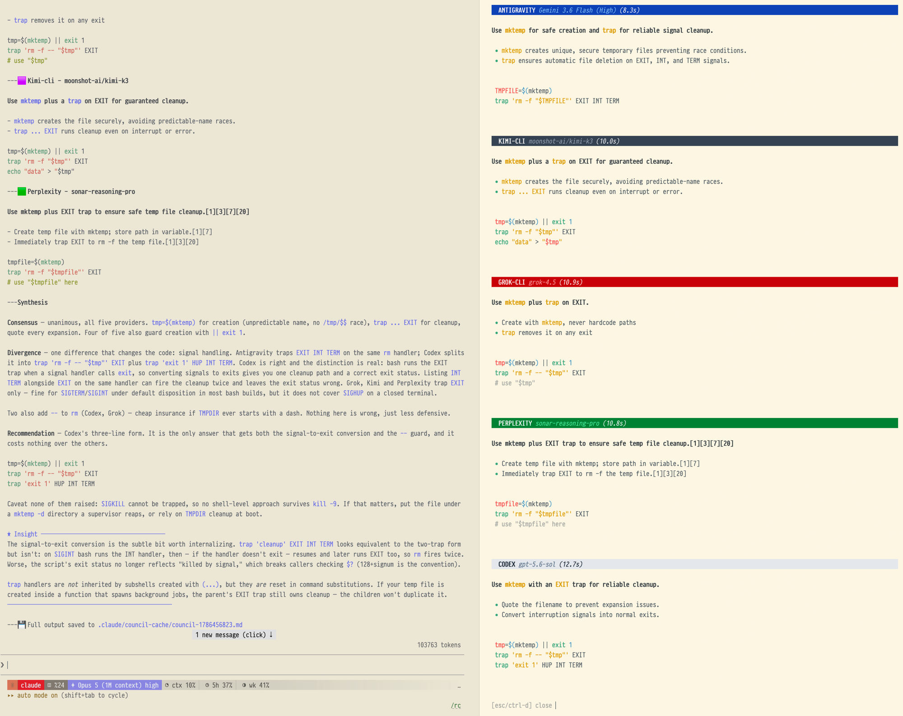

# claude-council

A Claude Code plugin that consults multiple AI coding agents in parallel and shows you their answers side-by-side. Useful when one model's bias could mislead you and the right call depends on cross-checking — architecture decisions, debugging dead ends, security reviews, framework picks.



Five providers answering the same question. Each banner names the provider, the
model that answered and how long it took. The synthesis separates what they all
agreed on from where they diverged — here, whether trapping `EXIT INT TERM` on
one handler is correct, or whether signals should be converted into exits
first — and when they agree instead, it names the assumption the answer rests
on.

[Quick start](#quick-start) · [Usage](#usage) · [Configuration](#configuration) · [Reference](#reference) · [Development](#development)

## Quick start

```bash
# 1. Install via Claude Code plugin marketplace
/plugin marketplace add hex/claude-marketplace
/plugin install claude-council

# 2. Configure at least one provider — any of these works:
export OPENAI_API_KEY="..."         # or GEMINI_API_KEY, XAI_API_KEY, PERPLEXITY_API_KEY, KIMI_API_KEY,
                                    # OPENROUTER_API_KEY
                                    # OR install the codex / antigravity (agy) / grok / kimi CLIs (uses your
                                    # existing subscription — no API key needed)

# 3. Ask anything
/claude-council:ask "Should I use UUID or BIGINT primary keys for a SaaS users table?"
```

You get side-by-side responses from each configured provider:

```
🔳 Codex - default
   Use UUID primary keys — they avoid enumeration, work across distributed
   services, and survive imports/exports cleanly.

🟦 Antigravity - default
   UUIDv7 specifically: security of non-guessable IDs plus the index
   locality of time-ordered sequences.

🟥 Grok - grok-latest
   BIGINT autoincrement — smaller index, faster joins. Handle public-
   exposure concerns with a separate UUID slug column.

🟩 Perplexity - sonar-reasoning-pro
   BIGINT: 25% smaller than UUID, better cache locality, with citations
   to Postgres benchmarks.

## Synthesis
Two providers prefer UUID(v7), two prefer BIGINT. Choice depends on
whether you need distributed ID generation.
```

When they all agree instead, the synthesis says what that agreement rests on,
because agreement is where it is easiest to stop asking:

```
## Synthesis
All five recommend SQLite. Read that as agreement about the reasoning, not
as verification: every provider was given the same description of a system
none of them can inspect. The answer assumes this stays single-node — the
one premise that would flip it, and the one nobody here could check.
```

Inside tmux, results stream into a side pane in real time with vendor-colored banners. Run `/claude-council:status` to confirm what's configured and connected.

## Features

- Query Gemini, OpenAI (GPT/Codex), Grok, Perplexity, and Kimi (Moonshot AI) simultaneously
- Seat any model OpenRouter routes to — Anthropic's Claude by default, so the council
  hears the one vendor it otherwise has no voice for
- Use the `codex`, `agy` (Antigravity), `grok`, and `kimi` (Kimi Code) CLIs (subscription auth) when installed — preferred over their API siblings
- Run a local `ollama` model as a council member — no key, no subscription, no network
- Side-by-side comparison of responses with vendor-colored headers
- Streaming tmux pane that renders responses as they land
- Specialized roles, debate mode, and agent-enhanced deep analysis for high-stakes decisions
- Background jobs (`--async`) for long-running queries, with `/claude-council:result` to fetch, list, and cancel
- Opt-in stop-gate: a second model reviews your uncommitted diff before Claude ends its turn
- Extensible provider system — add new AI agents easily
- Put the conversation itself to the council with `/claude-council:advise`, which shows you what would leave the machine before it goes
- Proactive agent that suggests consulting the council on architecture / debugging dead ends

## Installation

### From Marketplace (Recommended)

```bash
# Add the hex-plugins marketplace
/plugin marketplace add hex/claude-marketplace

# Install claude-council
/plugin install claude-council
```

### Manual (run from a local clone)

For normal use, prefer the marketplace or GitHub install above — both persist
across sessions. A manual clone is for running from a local working copy
(development, or offline). Clone the repo **anywhere**, then point Claude Code
at the repo root for the current session:

```bash
git clone https://github.com/hex/claude-council.git
claude --plugin-dir /path/to/claude-council    # repo root; loaded for this session only
```

> **Cloned it and nothing loads?** Two traps to avoid:
> 1. **Don't clone into `~/.claude/plugins/`** (Windows:
>    `%USERPROFILE%\.claude\plugins\`). That's Claude Code's managed install
>    *cache* — it is never scanned for manually-added plugins, so the plugin
>    won't appear in the Installed tab or respond to its slash commands.
> 2. **`pluginDirectories` in `settings.json` does nothing** — it isn't a real
>    setting, so it's silently ignored (no error shown). Use `--plugin-dir`
>    above for a local clone, or install via the marketplace / GitHub for a
>    persistent setup.

## Usage

### Slash Commands

```bash
# Query all configured providers
/claude-council:ask "How should I structure authentication in this Express app?"

# Query specific providers
/claude-council:ask --providers=gemini,openai "What's the best approach for caching here?"

# Include a specific file for review
/claude-council:ask --file=src/auth.ts "What's wrong with this implementation?"

# Attach a screenshot for visual critique
/claude-council:ask --image=shot.png "Why does this dialog render off-center?"

# Export response to markdown file
/claude-council:ask --output=docs/auth-decision.md "How should we implement authentication?"

# Quiet mode - show only synthesis
/claude-council:ask --quiet "What's the best caching strategy?"

# Check connectivity and configured models for each provider
/claude-council:status

# Run a long query in the background, fetch it later
/claude-council:ask --async "Deep-dive the tradeoffs of event sourcing here"
/claude-council:result <job-id>
```

### Quick Reference

| Flag | Description |
|------|-------------|
| `--providers=list` | Query specific providers (e.g., `gemini,openai,codex`) |
| `--roles=list` | Assign roles (e.g., `security,performance`, a preset like `balanced`, or `provider=role` pairs) |
| `--debate` | Enable two-round debate mode |
| `--file=path` | Include specific file in context |
| `--image=path` | Attach one image (e.g. a screenshot) for vision-capable providers |
| `--output=path` | Export response to markdown file |
| `--quiet` | Show only synthesis, hide individual responses |
| `--agents` | Agent-enhanced analysis, one Claude analyst per provider (slower, deeper) |
| `--local` | Local Claude-only council when you have no provider keys (see below) |
| `--async` | Detach the query as a background job; fetch with `/claude-council:result` |
| `--no-cache` | Force fresh queries, skip cache |
| `--no-auto-context` | Disable automatic file detection |
| `--no-pane` | Disable streaming tmux pane (default: on inside tmux) |
| `--verbosity=LEVEL` | Response style: `brief` / `standard` / `detailed` |

### Specialized Roles

Assign different perspectives to each provider for more comprehensive reviews:

```bash
# Use specific roles
/claude-council:ask --roles=security,performance,maintainability "Review this auth code"

# Use a preset
/claude-council:ask --roles=balanced "Review this implementation"

# Bind a role to a named provider instead of a position
/claude-council:ask --roles=openrouter-2=security,perplexity=devil "Review this design"
```

**Available roles:**
- `security` - Security Auditor (vulnerabilities, OWASP Top 10)
- `performance` - Performance Optimizer (efficiency, bottlenecks)
- `maintainability` - Maintainability Advocate (clarity, future changes)
- `devil` - Devil's Advocate (challenges assumptions)
- `simplicity` - Simplicity Champion (identifies over-engineering)
- `scalability` - Scalability Architect (growth, scaling)
- `dx` - Developer Experience (API ergonomics)
- `compliance` - Compliance Officer (GDPR, regulations)

**Presets:**
- `balanced` - security, performance, maintainability
- `security-focused` - security, devil, compliance
- `architecture` - scalability, maintainability, simplicity
- `review` - security, maintainability, dx

A bare list is **positional**: the first role goes to the first provider
discovery returns, the second to the second, and so on. That is fine for a fixed
roster and fragile for a growing one — adding a provider script shifts every
later provider's role by one, and reordering `OPENROUTER_MODELS` reassigns which
router seat plays which part. Both happen silently, because only non-empty roles
are printed.

`provider=role` pairs bind the two explicitly and survive both. The two forms
cannot be mixed in one `--roles` (a bare entry alongside a keyed one is
ambiguous); a pair naming a provider that is not being queried, or naming one
provider twice, is refused rather than resolved; and any provider left without a
role is named on stderr:

```
Note: no role for openai grok
```

### Debate Mode

Enable multi-round discussions where providers critique each other:

```bash
/claude-council:ask --debate "How should I structure the database schema?"
```

**How it works:**
1. **Round 1**: All providers answer the question normally
2. **Round 2**: Each provider sees the others' responses and provides rebuttals
3. **Synthesis**: Incorporates debate insights, consensus shifts, and unresolved tensions

Debate mode surfaces blind spots and stress-tests recommendations. The synthesis includes:
- Strongest criticisms raised
- Where providers changed positions after seeing alternatives
- Genuine disagreements that remain

Combine with roles for focused debates:
```bash
/claude-council:ask --debate --roles=security,performance,simplicity "Review this architecture"
```

### Agent-Enhanced Analysis (--agents)

For complex decisions where deeper analysis justifies the extra time and cost, `--agents` runs
one Workflow of parallel Claude analyst agents that each independently query, evaluate, and
analyze their provider's response before the orchestrator synthesizes everything. Each analysis
is returned as schema-enforced structured output, and an interrupted run can be resumed with the
finished analysts served from cache. Needs a Claude Code with the Workflow tool.

```bash
# Explicit flag
/claude-council:ask --agents "Should we migrate from REST to GraphQL? What are the tradeoffs?"

# Combine with other flags
/claude-council:ask --agents --roles=security,scalability --providers=gemini,openai "Review this auth architecture"
```

**What each analyst does (beyond a simple API call):**
1. Queries the provider
2. Evaluates response quality - did it actually address the question?
3. If the response is vague or off-topic, reformulates and retries
4. Asks follow-up questions to surface deeper insights
5. Extracts structured analysis: key recommendations, confidence level, blind spots

**Enhanced synthesis includes:**
- Confidence-weighted consensus (high-confidence agreement weighted more)
- Cross-provider blind spot analysis
- Divergence with context (why providers disagree)

**Natural language triggers**: The command also detects complex questions automatically.
If your question contains architecture, security review, tradeoff analysis, or similar
signals, you'll be asked whether to enable agent mode.

**Cost and performance implications**: Agent mode runs one Claude analyst agent per provider.
This means ~4x more Claude API usage and ~15-25 seconds additional latency compared to
standard mode. Use it for high-stakes decisions, not quick questions.

| | Standard (default) | Agent-enhanced (--agents) |
|---|---|---|
| Speed | ~3-5s | ~15-25s |
| Claude API cost | 1 context | 1 + N providers |
| Provider API cost | Same | Same |
| Analysis depth | Raw responses + synthesis | Pre-analyzed + enhanced synthesis |
| Best for | Quick questions, factual queries | Architecture decisions, security reviews, complex tradeoffs |

### Local Council (--local)

If you have no provider keys and no `codex` / `agy` / `grok` / `kimi` CLI and no
`ollama` installed, you can still convene a council, locally, using Claude alone:

```bash
# Explicit
/claude-council:ask --local "Is event sourcing worth it for this order service?"

# Pick the exact lenses yourself (skips the size prompt)
/claude-council:ask --local --roles=architecture "How should we shard this database?"
```

It spawns several Claude subagents in parallel, each pinned to a different role
and **blind to the others**, then synthesizes their perspectives. When you don't
pass `--roles`, it asks **how many members** to convene (default 4, up to 8) and
fills them from a diverse ordering led by the sharpest lenses (devil's-advocate,
simplicity, security, …). You don't need to pass `--local` explicitly: when a
query finds no configured providers, the command offers a local council instead
of erroring.

> **Honest caveat:** every member is Claude, so they share priors and training.
> Agreement between them is a *shared starting point to pressure-test*, not
> cross-vendor corroboration. The value is independent angles and blind-spot
> coverage — for genuinely independent models, configure a provider key or a CLI
> (`/claude-council:status` shows what's available). The synthesis is framed
> around angles and tensions, not "consensus", to keep this distinction clear.

### Quiet Mode

Get just the bottom line without individual provider responses:

```bash
/claude-council:ask --quiet "Should I use Redis or Memcached?"
```

Quiet mode still queries all providers and analyzes their responses, but only shows the synthesis with consensus/divergence analysis. Use when you want a quick answer without scrolling through multiple perspectives.

### Stated vs Assumed

Providers are given a description of your problem and never the system itself,
so they cannot test a premise your question asserts — they will reason from it
correctly, and agree with each other while doing it. A wrong assumption
therefore produces confident unanimity, which is the hardest failure to spot.

Before the question goes out, the council checks the claims it can check here
and labels the rest:

```
OBSERVED: four sessions logged this failure, confirmed in .cs/memory/
NOT VERIFIED: that the error text carries the tokens those notes are keyed on
```

A provider told "I have not checked whether X holds" can answer "then check X
first". One told "X holds" never will. If the answer turns mainly on facts
living on your disk, establish those first — a single agent that can read the
filesystem beats five that cannot.

### Auto-Context Injection

The council automatically detects and includes relevant files based on your question:

```bash
/claude-council:ask "How should I refactor the authentication flow?"
# Auto-detects and includes: src/auth/*.ts, middleware/auth.ts, etc.
```

Before querying, you'll see which files were auto-included:
```
Auto-included context (3 files):
  - src/auth/handler.ts (keyword: "auth")
  - middleware/session.ts (keyword: "session")
  - types/user.ts (keyword: "user")
```

To disable auto-context (for general questions not about your code):
```bash
/claude-council:ask --no-auto-context "What are best practices for API design?"
```

Auto-context limits:
- Maximum 5 files included
- Maximum ~10,000 tokens of context
- Skipped if you provide `--file=` explicitly

### Image Input

Attach one image (e.g. a UI screenshot) so vision-capable providers can critique it:

```bash
/claude-council:ask --image=shot.png "Why does this dialog render off-center?"
```

- Single image per query, raw size up to 10 MB, extensions: png / jpg / jpeg / webp / gif.
- `gemini`, `openai`, `grok`, `perplexity`, `kimi` and `openrouter` (on its default model) receive the image alongside the prompt.
- CLI providers answer through their vision sibling: `codex` via `openai`, `antigravity` via `gemini`, `grok-cli` via `grok`, `kimi-cli` via `kimi` (the slot is marked as a fallback). If the sibling is unusable (no API key), not vision-capable, or already answering in its own slot, the CLI provider answers text-only instead and its answer is prefixed with `(answered without the image)`. Selecting `ollama` directly is text-only.

Privacy: the image is sent to the providers that can see it, but its bytes are **not** written to cache entries or the saved `council-*.md` transcripts — only a hash of the image keys the cache.

### Response Caching

Responses are automatically cached to speed up repeated queries and save API costs:

```bash
# Uses cache if available (default)
/claude-council:ask "What's the best testing framework?"

# Force fresh queries, skip cache
/claude-council:ask --no-cache "What's the best testing framework?"
```

Cache configuration:
```bash
export COUNCIL_CACHE_DIR=".claude/council-cache"  # Cache location (default)
export COUNCIL_CACHE_TTL=3600                      # Cache lifetime in seconds (default: 1 hour)
```

Cached responses show `cached` instead of `success` in the status output. Cache is keyed by prompt + provider + model + role, so:
- Changing models invalidates the cache
- Using `--roles` creates separate cache entries (same prompt with different role = cache miss)
- Debate mode round 2 rebuttals are not cached (they depend on round 1 content) — with one exception: if a CLI provider fails in round 2 and falls back to its API sibling, that fallback rebuttal is cached, keyed on the full debate prompt (which already includes the round 1 answers)

Privacy: cache entries and the saved `council-*.md` transcripts store the **full prompt in cleartext** — including any files you pass with `--file` and the auto-included context. Council drops a `.gitignore` (`*`) into the cache dir so these never get committed, but the plaintext still lives on local disk under `COUNCIL_CACHE_DIR` until it ages out or you clear it.

### Export to File

Save council responses as clean markdown files for documentation or sharing:

```bash
/claude-council:ask --output=docs/decision.md "Should we use REST or GraphQL?"
```

The exported file includes:
- Metadata header (query, date, providers)
- Each provider's full response
- Synthesis with consensus/divergence analysis

Great for:
- Documenting architectural decisions
- Sharing with team members who aren't using Claude
- Creating an audit trail of AI-assisted decisions

### Background Jobs (--async)

Reasoning and deep-research models can take minutes. `--async` detaches the
query as a tracked background job instead of blocking the conversation:

```bash
/claude-council:ask --async "Compare migration strategies for this schema"
# → job id, returned immediately

/claude-council:result              # list jobs
/claude-council:result <job-id>     # fetch a finished result (synthesis included)
/claude-council:result cancel <id>  # terminate a running job
```

Each job persists as a JSON record plus log under a per-workspace state
directory (`$CLAUDE_PLUGIN_DATA`, falling back to tmp). A crashed worker is
marked `failed` automatically; finished jobs are pruned beyond
`COUNCIL_MAX_JOBS` (default 20).

### Proactive Agent

The `council-advisor` agent will suggest consulting the council when:
- Discussing architecture or design decisions
- Stuck debugging after multiple failed attempts

### Asking about the conversation itself

`/claude-council:ask` sends a question you typed. `/claude-council:advise` sends
a bounded slice of the current conversation, so providers see the reasoning
rather than your summary of it. A model given only your framing tends to agree
with your framing.

```bash
# Ask the council about the approach taken so far
/claude-council:advise "are we solving the right problem here?"

# Narrow the window
/claude-council:advise --turns=last:10 "what did we miss?"
```

Every run resolves this session's transcript, digests it, and shows the byte
size, the turn count and the opening lines before asking whether to send. The
digest carries human turns, assistant replies, and each AskUserQuestion exchange
as the question, its options, and the pick; it excludes every other tool result
and tool input, thinking blocks, hook output, and messages from other sessions.
The script skips a damaged record inside the transcript, counts it, and writes
the count into the digest itself, so an incomplete digest says so where both
the user and the providers read it.

The confirmation is the privacy control, and deliberately so: a script cannot
tell whose conversation it holds, because inside a subagent the ambient session
id names the parent conversation.

## Configuration

### API Keys

Set environment variables (recommended):

```bash
export GEMINI_API_KEY="your-key"
export OPENAI_API_KEY="your-key"
export XAI_API_KEY="your-key"          # GROK_API_KEY also accepted
export PERPLEXITY_API_KEY="your-key"
export KIMI_API_KEY="your-key"         # MOONSHOT_API_KEY is read as a fallback,
                                       # but only KIMI_API_KEY makes kimi discoverable
export OPENROUTER_API_KEY="your-key"   # one key, any model on openrouter.ai/models
```

`openrouter` seats whatever model `OPENROUTER_MODEL` names, defaulting to
`anthropic/claude-sonnet-5` — the one vendor the council has no direct seat for.
To seat several routed models at once, list them instead:

```bash
export OPENROUTER_MODELS="deepseek/deepseek-v3.2,z-ai/glm-5.3,qwen/qwen3-max"
```

Each entry becomes its own council member — `openrouter-1`, `openrouter-2`,
`openrouter-3` — with its own header, model label, cache entry and role, all
sharing the one key. `--providers=openrouter-2` picks one out. The list replaces
the single `openrouter` seat rather than adding to it, so the same model never
answers twice under two headers. Reordering the list reassigns the numbers, which
matters only if you pin roles positionally. A seat that should accept images opts
in by number (`OPENROUTER_2_VISION=1`): the roster can hold any model, and nothing
in the id says whether it reads images.
Two things follow from it being a router. Your prompt reaches OpenRouter and then
the upstream serving that id, so it is two disclosures rather than one. And
pointing it at a model another seat already runs (`OPENROUTER_MODEL=openai/gpt-5.6`
alongside `OPENAI_API_KEY`) gives you two headers voicing one model: the synthesis
is told to read that agreement as possible duplication, not corroboration.

`ollama` needs no key at all: install it, pull a model, and it joins the council
as a local provider.

### CLI Providers (subscription auth, no API key)

If the `codex`, `agy`, `grok`, or `kimi` CLIs are installed and on `PATH`, they're discovered automatically and **preferred over their API siblings** by default:

- `codex` (OpenAI Codex CLI) shadows the `openai` API provider — uses your `~/.codex/config.toml` model unless `CODEX_MODEL` is set
- `antigravity` (Antigravity CLI, `agy`) shadows the `gemini` API provider — uses the model selected in the Antigravity app unless `ANTIGRAVITY_MODEL` is set
- `grok-cli` (xAI Grok CLI, `grok`) shadows the `grok` API provider — uses the grok CLI's own default model unless `GROK_CLI_MODEL` is set
- `kimi-cli` (Kimi Code CLI, `kimi`) shadows the `kimi` API provider, using the kimi CLI's own configured model unless `KIMI_CLI_MODEL` is set

`ollama` is also discovered from `PATH`, but it is local and keyless rather than subscription-backed, so it shadows nothing and has no API sibling.

CLI providers use your existing CLI subscription: no API key, no per-call cost. To opt back into the API variant for a single call, pass it explicitly: `--providers=openai`, `--providers=gemini`, `--providers=grok`, or `--providers=kimi`. Listing both API and CLI together (e.g., `--providers=grok,grok-cli`) runs them side-by-side for comparison.

If a CLI provider fails at query time and its API sibling's key is set, the council automatically retries through that API sibling and marks the slot as a fallback (the answer is shown under the CLI slot with the API model's name and a "fell back to … API" note). The fallback is skipped when the sibling is already in your selected providers, so you never get the same vendor's answer twice.

Override CLI model selection. Left unset, the council reads what each CLI has
selected — `~/.codex/config.toml` (or `$CODEX_HOME`), `~/.grok/config.toml`,
`~/.kimi-code/config.toml`, and agy's own settings — and names that model in
the response banner, so you can see which model answered without pinning one:

```bash
export CODEX_MODEL="gpt-5-codex"                # default: the codex CLI's own configured model
export ANTIGRAVITY_MODEL="Gemini 3.1 Pro (High)"  # default: the model selected in the Antigravity app
export GROK_CLI_MODEL="grok-4.3"                # default: the grok CLI's own default model
export KIMI_CLI_MODEL="kimi-k3"                 # default: the kimi CLI's own configured model
```

The Antigravity CLI cannot take its prompt on stdin — `--print` with no value
prints the help — so the prompt is the value of `-p` and rides the command line.
Windows caps that at 32k, which a `--file`-sized prompt would exceed
(CreateProcess fails with error 206), so past `COUNCIL_ARGV_LIMIT` (default
24000 chars) the prompt is written to a file and agy is told to read it. The
file gets a directory of its own, which is the only thing `--add-dir` opens to
the sandboxed agent, and it is removed when the run ends.

### Pinning a standing provider roster

Discovery enlists everything it finds, which is rarely what you want once more
than a couple of agents are installed. `COUNCIL_PROVIDERS` pins the default set;
an explicit `--providers` still overrides it per call.

```bash
export COUNCIL_PROVIDERS="codex,antigravity"  # queried by default, nothing else
```

`--list-default` and `--list-available` both report the pinned roster, so neither
tooling nor the human-readable view disagrees with what a query would actually
run. Spaces around the commas are fine, in the variable and in `--providers`
alike.

The Kimi CLI runs every prompt under an agent definition that grants it no tools
(`prompts/kimi-cli-agent.md`). Its print mode auto-approves tool calls, so the
council denies them outright rather than letting a prompt drive file writes or
shell commands.

### Verbosity

Shape how providers respond by prepending a directive to their system prompts. Affects style and depth, not just length:

```bash
export COUNCIL_VERBOSITY=brief     # ~3-5 sentences, bullets, no code
export COUNCIL_VERBOSITY=standard  # default — balanced thoroughness
export COUNCIL_VERBOSITY=detailed  # thorough analysis with code + edge cases
```

Or per-call: `--verbosity=brief|standard|detailed`. The slash command also asks via the provider-selection prompt.

| Level | Typical output |
|-------|----------------|
| `brief` | 3-5 sentences max, bullets where possible, skips code blocks unless asked |
| `standard` | Balanced — current default behavior, no directive prepended |
| `detailed` | Thorough — includes code examples, edge cases, trade-offs, and rationale |

### Stop-Gate Review (opt-in, off by default)

A Stop hook can ask one council provider to review your uncommitted `git diff`
before Claude ends its turn, blocking only on a first-line `BLOCK:` verdict.
Enable it per project:

```bash
cat > .claude/council-stop-gate.json <<'EOF'
{"enabled": true, "provider": "codex", "max_iterations": 1}
EOF
```

Safety properties: it never blocks on a clean tree, never re-gates a
continuation already triggered by a stop hook, caps blocks per session at
`max_iterations`, and any reviewer failure allows the stop. Delete the file
(or set `"enabled": false`) to turn it off.

Privacy: the review sends your full uncommitted `git diff` to the configured
provider, named by its provider id. With `ollama` it never leaves the machine.
With a CLI provider (`codex`, `antigravity`, `grok-cli`, `kimi-cli`) it stays
within that tool's own subscription auth; with an API provider (`gemini`,
`openai`, `grok`, `perplexity`, `kimi`) the diff is transmitted to that
third-party API — `kimi` sends it to Moonshot. `openrouter` is the one seat that
discloses twice: to OpenRouter, and onward to whichever upstream serves the model
id you pinned. Keep the reviewer on `ollama`, or on a CLI provider, if your
working tree may contain secrets.

## Reference

Detail-heavy knobs you'll only need occasionally. The defaults are sensible for most workflows.

### Model Selection

Override default models via environment variables:

```bash
export GEMINI_MODEL="gemini-flash-latest"           # default (tracks Google's current Flash)
export OPENAI_MODEL="gpt-5.6-sol"                   # default
export GROK_MODEL="grok-latest"                     # default (tracks xAI's current flagship)
export PERPLEXITY_MODEL="sonar-reasoning-pro"       # default (reasoning + search)
export KIMI_MODEL="kimi-k3"                         # default (reads images)
export KIMI_VISION=1                                # only needed when KIMI_MODEL
                                                    # names an image-capable model
                                                    # other than the default
export COUNCIL_AGENT_MODEL="sonnet"                 # default: the model the --agents
                                                    # ANALYSTS run on (sonnet/opus/haiku/fable).
                                                    # Not a provider model — see below.
export OPENROUTER_MODEL="anthropic/claude-sonnet-5"  # default (single seat)
export OPENROUTER_MODELS="a/b,c/d,e/f"              # or: one seat per entry
export OPENROUTER_2_MODEL="c/d-pinned"              # overrides roster seat 2's entry;
                                                    # what the exit-3 degrade path sets
export OPENROUTER_REASONING_TOKENS=8000             # thinking budget per request (default 8000; 0 lets the model decide)
export OPENROUTER_VISION=1                          # only needed when OPENROUTER_MODEL
                                                    # names a model that accepts images
export OPENROUTER_2_VISION=1                        # same, for roster seat 2
export OLLAMA_MODEL="llama3.2"                      # default: whichever model `ollama list` shows first
export OLLAMA_HOST="http://localhost:11434"         # default
export GEMINI_THINKING_BUDGET=8192                  # optional: cap Gemini's internal reasoning tokens (unset: the model decides)
```

`COUNCIL_AGENT_MODEL` is the odd one out: every other variable here names a model
that *answers* the question, while this one names the Claude analyst that wraps a
provider in `--agents` mode — it runs the query, judges the reply and returns a
structured analysis. It is pinned rather than inherited from your session, so the
cost of a mode that already spawns one agent per provider does not swing by a
factor of several depending on which model you happen to be running. One measured
run of eight seats came to ~456k analyst tokens.

Gemini and Grok default to their vendor's rolling alias, so the council follows
a new flagship without a release. Pin an explicit id when you need a fixed model
across runs: cached answers key on the id, so an alias can serve an answer the
model behind it no longer gives, and the response header names the alias rather
than the model that answered.

Response length cap (default: 2048; `ollama` uses 4096, since local reasoning
models spend much of the budget on thinking that never reaches the answer):

```bash
export COUNCIL_MAX_TOKENS=4096  # longer responses
export COUNCIL_MAX_TOKENS=1024  # shorter, faster responses
```

### Model fallback

If a provider's default model is unavailable for your API key or region, the
council answers with a verified fallback model instead of failing, and says so
in the response header:

```
## 🟥 Grok - grok-4.20-reasoning (grok-latest unavailable)
```

| Provider | Default | Fallback |
|---|---|---|
| openai | `gpt-5.6-sol` | `gpt-5.5-pro` |
| grok | `grok-latest` | `grok-4.20-reasoning` |
| gemini | `gemini-flash-latest` | `gemini-3.5-flash` |
| perplexity | `sonar-reasoning-pro` | `sonar-pro` |
| kimi | `kimi-k3` | `kimi-k2.6` |
| ollama | first local model (`OLLAMA_MODEL` to pin) | — |
| openrouter | `anthropic/claude-sonnet-5` | — |

The same substitution is also noted on stderr and folded into the synthesis,
so it's visible even in quiet mode or a headless run. Setting `<PROVIDER>_MODEL`
explicitly disables the fallback for that provider — an explicit choice is
respected verbatim.

The verdict — "this model is unavailable for this key" — is cached for a day
so it isn't retried on every query, and the council returns to the default
automatically once it becomes available. This is a separate cache from the
response cache above (`COUNCIL_CACHE_DIR` / `COUNCIL_CACHE_TTL`): it tracks
per-model availability, not full answers. Tune it with `COUNCIL_AVAILABILITY_TTL`
(seconds, default `86400`); set it to `0` to re-check on every query. It is
independent of `--no-cache`, which only forces fresh *answers*.

### Reasoning Models

For reasoning models from any provider, the token limit is automatically increased to 8x the base value (minimum 32768). This is because reasoning models combine internal thinking tokens and visible output tokens into a single `max_output_tokens` limit — without the bump, the model can run out mid-response.

The bump applies to:

- **OpenAI**: `codex-*`, `*-codex`, `o3-*`, `o4-*`, `gpt-5.[4-9]*`
- **Gemini**: `gemini-3*`, `*thinking*`, `gemini-*-latest`
- **Grok**: `*reasoning*`, `grok-4*`, `grok-3-mini-*`, `grok-build-*`, `grok-latest`
- **Perplexity**: `sonar-reasoning*`, `*deep-research*`
- **Kimi**: `kimi-k*` (so the default model always triggers the bump)
- **OpenRouter**: every routed model. The seat can be pointed at any id, and a
  pattern list misses reasoning models whose names carry no tell
  (`z-ai/glm-5.3-flash`, `xiaomi/mimo-v2.5`), which then spend the whole base
  thinking and answer with nothing. `max_tokens` is a ceiling, not a spend, and
  OpenRouter clamps a value above an upstream's own limit rather than rejecting
  it, so the bump is free
- **Ollama**: `*r1*`, `*reason*`, `*gpt-oss*`, `qwen*`, `gemma*`, `deepseek*`

The OpenRouter seat also sends a thinking budget, `reasoning.max_tokens`, on
every request (default 8000; `OPENROUTER_REASONING_TOKENS` overrides it, `0`
sends none). The two caps do different jobs. `max_tokens` bounds thinking and
answer together, so a model can spend the whole cap thinking and answer with
nothing. The budget bounds the thinking alone, leaving room for the answer: a
routed model that would otherwise think for twenty thousand tokens on a long
prompt, and outlast `COUNCIL_TIMEOUT`, answers inside two minutes. Upstreams
without direct allocation map the number to an effort level, and adaptive
models ignore it.

| Model Type | COUNCIL_MAX_TOKENS | Actual Limit |
|------------|-------------------|--------------|
| Standard (gpt-5.1) | 2048 (default) | 2048 |
| Reasoning (gpt-5.6-sol) | 2048 (default) | 32768 |
| Reasoning (gpt-5.6-sol) | 4096 | 32768 |

Control reasoning effort to balance speed vs thoroughness:

```bash
export OPENAI_REASONING_EFFORT="low"     # faster, less reasoning overhead
export OPENAI_REASONING_EFFORT="medium"  # default - balanced
export OPENAI_REASONING_EFFORT="high"    # thorough reasoning, slower
```

Grok's token accounting depends on the model: `grok-build` counts thinking tokens separately, so `max_tokens` caps only its visible output; the other reasoning models (`grok-4*`, `*-reasoning`, `grok-3-mini-*`) share one budget between thinking and output. Either way, council bumps the cap for these models so a long answer isn't cut off mid-response.

### Perplexity Search Features

Perplexity's sonar models are search-augmented, providing web-grounded responses with citations:

```bash
# Filter search results by recency: day, week, month, year
export PERPLEXITY_RECENCY="week"
```

Available models:
- `sonar` - Fast, search-enabled
- `sonar-pro` - More capable, search-enabled
- `sonar-reasoning` - Chain-of-thought reasoning + search
- `sonar-reasoning-pro` - Best reasoning + search (default)

Perplexity is useful when you need current information (latest framework versions, recent best practices) rather than just training-data knowledge.

### Retry & Timeout

Automatic retry on transient failures (429 rate limits, 5xx server errors):

```bash
export COUNCIL_MAX_RETRIES=3    # default: 3 retries
export COUNCIL_RETRY_DELAY=1    # default: 1 second initial delay (doubles each retry)
export COUNCIL_TIMEOUT=300      # default: 300 seconds per API request
export COUNCIL_CLI_TIMEOUT=1200 # default: 1200 seconds per CLI-provider run
```

Timeouts fail fast (no retry) to prevent blocking on hung providers.

Retries apply to the API providers, whose requests go through `curl`; a
transient 429 or 5xx is worth another attempt. The CLI providers get a single
attempt, because a CLI that is merely slow is not a transient failure and
retrying it multiplies the wait. That is why their default bound is higher: an
API provider may spend up to `(COUNCIL_MAX_RETRIES + 1) × COUNCIL_TIMEOUT`,
so one shared number would give a CLI a deadline four times stricter. Setting
`COUNCIL_TIMEOUT` explicitly overrides both.

CLI providers reading a large `--file` are the ones that hit this — a 64KB
payload has taken kimi past fifteen minutes.

### Display & Terminal Integration

When run inside tmux, council opens a streaming side pane that shows live provider status (`querying`, `complete`, `cached`, `error` with timing) and renders each response as it lands. Rendering prefers [Rich](https://github.com/Textualize/rich) when a Rich-capable Python is available (`python3` with a modern `rich` installed, or [`uv`](https://docs.astral.sh/uv/), which fetches it on demand): word-wrapped prose, tables fitted to the pane width, syntax-highlighted code, clickable links — styled with your terminal's own palette (cyan headings, yellow code, vendor-colored banners). Without one, a built-in dependency-free perl markdown renderer takes over with the same visual language, so nothing needs to be installed. Press **Esc** or **Ctrl-D** to close the pane.

A provider that fails shows its error text under a `✗ <provider> error` heading. When any provider has failed, the pane then offers `[r] retry failed (<providers>) · [esc/ctrl-d] close` with a countdown: **r** re-queries only the failed providers inside the same run, so a recovered answer reaches the synthesis, the saved transcript and the cache like any other; **Esc** closes the pane and the run carries on with what it has. The offer stays open for `COUNCIL_RETRY_WAIT` seconds (default 45; `0` disables it) and is made once per run. The run waits while the offer is open, so a retry extends the council's wall time by another provider round. `--async` jobs default to `0`: nobody is committed to answering a detached run's pane, so it never waits.

Resizing the window reflows the pane. Wrap width is chosen when a response is rendered, so answers that landed at different widths would otherwise sit side by side at different widths; once the new width has held still for about half a second, every answer so far is re-rendered to it, at the close prompt as well as mid-run. The wait is deliberate: dragging a pane border reports a stream of intermediate widths, and re-rendering each one would cost a second of work and your scrollback every time. The redraw clears the pane's scrollback along with the screen, which resets copy-mode position.

Colors adapt to your terminal theme: the pane detects the background
(OSC 11 query, `COLORFGBG` fallback). The Rich renderer flips its
code-highlighting theme to match; the perl renderer renders bold/italic
emphasis bright on dark themes, dark on light themes, and attribute-only when
undetectable, with muted text (link URLs, table grid lines, `---` rules,
sub-headings, the "waiting on" label) following suit — faint/bright-black on
dark, a readable dark gray on light.
Force it with `COUNCIL_THEME=light` or `COUNCIL_THEME=dark`.

When the outer terminal is iTerm2, council also drives:

- **Tab color** — yellow while querying, green on success, red if any provider errored. Set via `it2setcolor`; ambient state signal without looking at the terminal.
- **Dock attention** — bounces the iTerm2 dock icon when council finishes if the run took longer than `COUNCIL_ATTENTION_THRESHOLD` (default 2000ms). Useful for slow `--debate` queries when you've switched apps.
- **`SetMark` navigation** — emits OSC 1337 SetMark before each provider response inside the pane. Cmd+Shift+↑/↓ in iTerm2 jumps between provider sections.

```bash
export COUNCIL_NO_PANE=1                # disable the streaming pane globally
export COUNCIL_RENDERER=perl             # force the built-in perl renderer
export COUNCIL_ATTENTION_THRESHOLD=5000  # only bounce dock if run > 5s
export COUNCIL_RETRY_WAIT=45             # seconds the pane's retry offer stays open (0 disables)
```

Per-call opt-out via `--no-pane`. iTerm2 features no-op silently outside iTerm2; pane no-ops outside tmux.

## Adding New Providers

See the `provider-integration` skill for guidance on adding new AI providers.

## Direct Script Usage

Use the scripts directly without Claude Code (for automation, CI, or debugging):

```bash
# Basic query - returns JSON
bash scripts/query-council.sh -- "What is dependency injection?"

# With flags
bash scripts/query-council.sh --providers=gemini,openai --roles=balanced -- "Review this pattern"

# Resolve this session's transcript, then digest a window of it
bash scripts/session-transcript.sh <session-id>
bash scripts/transcript-digest.sh --turns last:25 <path/to/transcript.jsonl>

# Pipe to formatter for terminal display
bash scripts/query-council.sh --providers=gemini -- "Question" 2>/dev/null | bash scripts/format-output.sh

# Check provider status (the Perplexity check makes one minimal billable request,
# since Perplexity has no free /models endpoint to probe)
bash scripts/check-status.sh

# List configured providers (human-readable, with policy info)
bash scripts/query-council.sh --list-available

# List the providers that would be queried by default (machine-readable)
bash scripts/query-council.sh --list-default

# Same set, each paired with the model it would send: "<provider>\t<model>" per
# line. Router seats carry no model in their name, so this is what a picker or
# any other tool needs to label them.
bash scripts/query-council.sh --list-default-models
```

**JSON output structure:**
```json
{
  "metadata": {
    "prompt": "...",
    "roles_used": ["security", "performance"],
    "debate_mode": false,
    "quiet_mode": false,
    "timestamp": "2025-12-18T12:00:00Z"
  },
  "round1": {
    "gemini": { "status": "success", "response": "...", "model": "...", "role": "security" },
    "openai": { "status": "success", "response": "...", "model": "...", "role": "performance" }
  },
  "round2": { ... }  // Only present if --debate
}
```

## Requirements

- `curl` and `jq` for API calls
- Valid API keys for at least one provider, OR `codex` / `agy` (Antigravity) / `grok` / `kimi` CLI installed, OR `ollama` running locally
- Optional: a Rich-capable Python (`python3` with a modern `rich`, or `uv`) upgrades the tmux pane's markdown rendering; without it the built-in perl renderer is used
- macOS, Linux, or Windows via Git Bash; the test suite runs on all three in CI

## Development

### Architecture

See [docs/ARCHITECTURE.md](docs/ARCHITECTURE.md) for system design, data flow diagrams, and component details.

### Versioning

Bump version in `.claude-plugin/plugin.json` on every release:

```json
{
  "version": "YYYY.M.PATCH"
}
```

Format: `YYYY.M.PATCH` where PATCH increments with each release. Examples: `2026.1.1`, `2026.1.2`, `2026.2.1`.

**Always bump version when:**
- Changing command behavior
- Fixing bugs
- Updating formatting/output
- Any change users should pull

### Testing

```bash
# Run automated tests (requires bats-core)
./tests/run_tests.sh

# Run specific test suite
bats tests/cache.bats
bats tests/cli-providers.bats
bats tests/roles.bats
```

CLI-provider paths are tested hermetically: `tests/fixtures/fake-clis.bash`
installs fake `codex`/`agy`/`grok`/`kimi`/`ollama` executables onto `PATH` whose behavior is
switched via `COUNCIL_FAKE_BEHAVIOR` and which record every invocation, so
provider scripts, async jobs, and the stop gate run end-to-end with no
network and no real CLIs.

See `TESTING.md` for complete test documentation including manual test procedures.

### Release Checklist

1. Make changes
2. Test locally
3. Bump version in `.claude-plugin/plugin.json`
4. Commit and push
5. Users update via `/plugin update claude-council`
